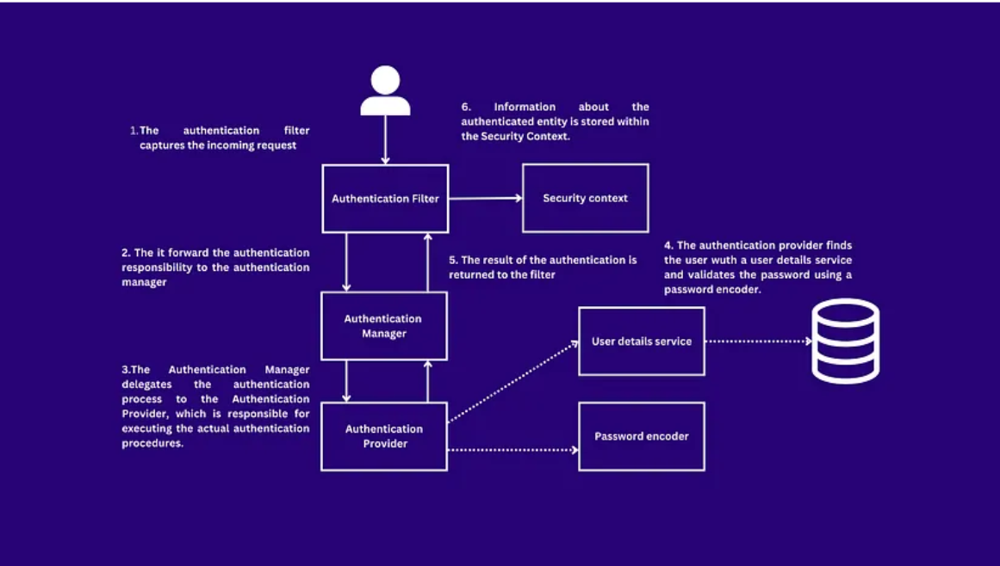

ObjectMapper => is a powerful utility to handle JSON serialization and deserialization in Java. It converts Java objects into JSON and vice versa.

JSON serialization and deserialization =>  are processes that convert data into a format that can be stored or transmitted, and then back into its original format:
Serialization: Converts an object's state, or the values of its properties, into a format that can be stored or transmitted.
Deserialization: Reconstructs an object from the serialized form.

Nested Object Deserialization => To explain further, if you have a complex object structure where some fields themselves are JSON (or strings that represent JSON), you would need to deserialize them as well to convert them back to objects. The more deeply nested the objects are, the more times you'll need to perform the deserialization process.

printStackTrace => e: This represents the exception object that was thrown. In your case, it's an instance of some exception class, such as IOException or JsonProcessingException. The e object contains information about the exception, such as the type of exception and the stack trace (which provides details about where the exception occurred).
printStackTrace(): This method is called on the exception object e. It prints the stack trace of the exception to the standard error stream (usually the console or terminal). The stack trace contains information about:
The class and method where the exception occurred.
The line number in the source code where the exception was thrown.
The sequence of method calls that led to the exception (the call stack).

logger.severe: => 
logger.severe is a method provided by the Java Logging API (java.util.logging.Logger) to log messages at the SEVERE level.
The SEVERE level is used for logging messages that indicate a critical failure in the application, such as an exception or an unrecoverable error.

Password Encoder Article => 
https://medium.com/@yassir.acaf/deep-dive-in-password-management-in-spring-security-f7b8658d09d2

